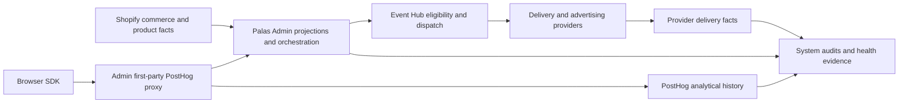
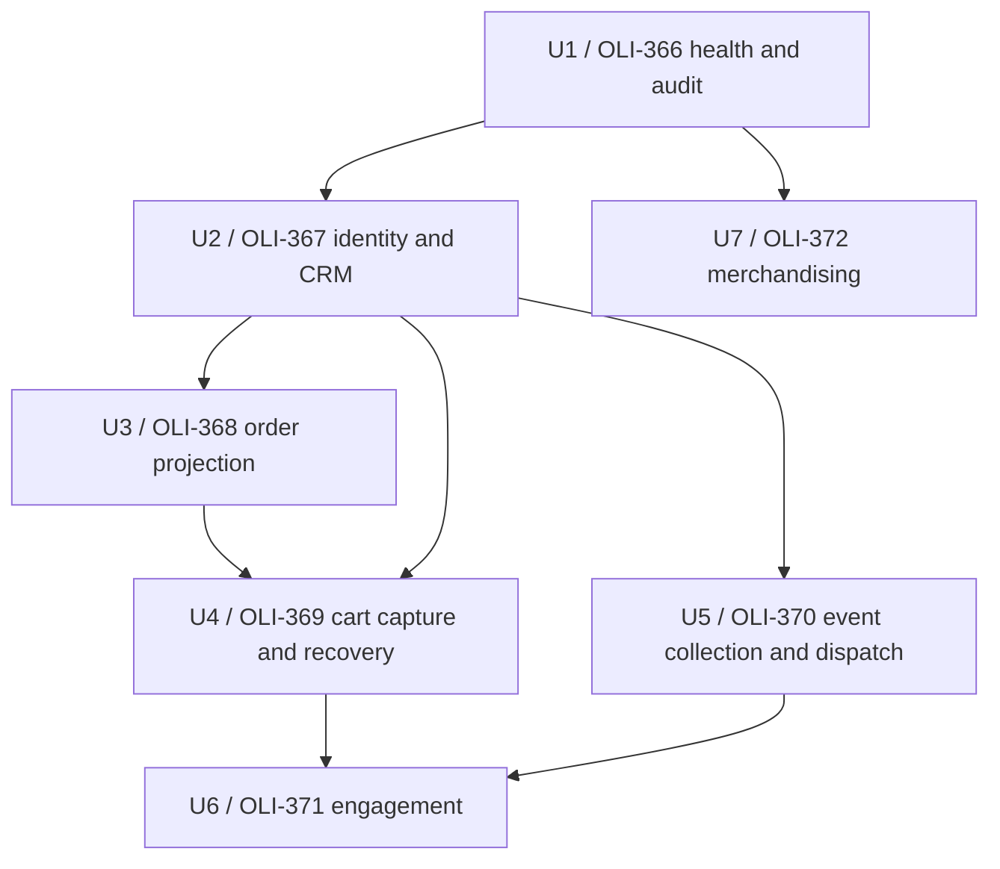
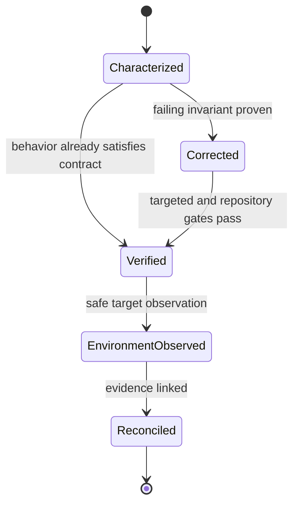

# Stabilize Admin Critical Capabilities

## Goal Capsule

Stabilize the seven Admin capabilities confirmed critical by OLI-335 through
separate, dependency-ordered pull requests. Each capability must earn its
Verification Contract evidence through characterization, targeted correction,
and proportional operational proof.

Authority descends from OLI-335, then the Platform Verification Contracts, then
this plan, then the current Admin implementation. A conflict with the confirmed
source-of-truth decisions stops the affected child issue; uncertainty about
current behavior becomes characterization work rather than a guessed rewrite.

The execution profile is proof-first and reversible. Every child owns its own
branch, worktree, tests, PR, and CI tail. No child merges or deploys as part of
this plan, and no child may push `refactor` or `main`.

---

## Product Contract

### Summary

Palas Admin must preserve critical customer, commerce, event, engagement,
merchandising, and operational projections without silent loss or ambiguous
ownership. Stabilization is complete only when observable behavior, failure
handling, reconciliation, and rollback evidence exist for each capability.

### Problem Frame

The Platform baseline found substantial Admin implementation and 56 test files,
but only code-observed evidence for these capabilities. The source-of-truth
catalog still contains transport, trigger, deduplication, audit, reconciliation,
retry, and rollback unknowns. A single global refactor would mix independent
failure domains and make the evidence impossible to attribute.

### Requirements

- R1. Each capability is delivered by exactly one Linear child and one Admin PR.
- R2. Existing behavior is characterized before behavior-changing corrections.
- R3. Inputs and projections preserve explicit source and authority provenance.
- R4. Replays are idempotent or expose a documented deduplication boundary.
- R5. Partial failures remain visible and have a replay, reconciliation, or safe
  rollback path.
- R6. Audit records exclude secrets and avoid unnecessary personal payloads.
- R7. Test, preview, and local verification cannot write to production by
  default.
- R8. Critical paths receive unit or pure, integration, and targeted runtime
  evidence; reconciliation and E2E evidence are added where the source contract
  requires them.
- R9. Provider facts remain provider-owned while Admin keeps its confirmed
  orchestration and projection responsibilities.
- R10. The existing PostHog invariant remains intact: browser SDK traffic uses
  the Admin first-party proxy, Admin resolves identity and decides dispatch,
  PostHog retains analytical history, and Event Hub receives only dispatchable
  events.

### Acceptance Examples

- AE1. Replaying a Shopify order delivery does not create a second projection,
  and reconciliation reports the same canonical order.
- AE2. An identity conflict is recorded as a conflict and never silently
  overwrites an authoritative identifier.
- AE3. A non-dispatchable CRM event remains available for the operational
  projection but does not reach an advertising connector.
- AE4. A provider outage produces a durable retry or failed state and a visible
  health signal without a test environment sending real traffic.
- AE5. A merchandising field is written only by the system designated as its
  authority; conflicts remain visible before publication.

### Scope Boundaries

In scope are the Admin implementation and evidence for the seven contracts
listed below. Small corrections directly proved by characterization are in
scope within their child PR.

Out of scope are global refactors, deployment mapping changes, production
backfills, provider migrations, a second browser tracker, direct browser
dispatch to analytics or advertising providers, and changes to the Shopify
theme.

### Deferred to Follow-Up Work

- Storefront B2C emission of any currently absent cart or event transport
  requires a separate `repo:storefront-b2c` issue.
- Changes to Mantajs framework behavior require a separate `repo:mantajs`
  issue and package release.
- Platform Verification Contract status updates belong to a later
  `repo:platform` reconciliation after target-environment evidence exists.

---

## Planning Contract

### Key Technical Decisions

- KTD1. Split by Verification Contract and deliver through OLI-366 to OLI-372.
  This is chosen over one OLI-336 implementation branch because evidence and
  rollback must remain attributable to one failure domain.
- KTD2. Start with platform health and audits. This is chosen over starting with
  a business projection because later slices need trustworthy failure and
  reconciliation signals.
- KTD3. Characterize before correction in every child. Existing tests establish
  the baseline; a correction follows only a failing scenario tied to a contract
  invariant.
- KTD4. Preserve source authorities from OLI-335: Shopify owns B2C commerce
  facts and product data, Admin owns identity plus orchestration and operational
  projections, and providers own delivery facts.
- KTD5. Preserve the first-party PostHog topology described by R10. No child may
  add GTM, a direct GA/Meta/TikTok browser path, or another tracker.
- KTD6. Prefer replay and reconciliation to manual mutation. A data repair or
  backfill remains dry-run or non-production by default until a separate
  operational approval.

### High-Level Technical Design

The diagrams are directional. Each child must confirm the current runtime path
before altering it.

### System-Wide Impact

The work touches persistent projections and external boundaries. Every child
must trace lifecycle effects from input through local state, downstream
dispatch, audit, and recovery. Cross-repository deficiencies are recorded as
follow-up issues instead of being patched from the Admin branch.

### Risks and Dependencies

- The Platform catalog contains older unresolved labels even though OLI-335
  records the product decisions. OLI-335 is authoritative; contract status is
  not upgraded without environment evidence.
- Local tests can prove runtime composition and failure behavior but cannot
  prove production scheduling or provider delivery. Those remain explicit
  target-environment observations.
- Some Admin tests import generated Manta globals. Test additions should follow
  existing pure helper and runtime smoke patterns rather than creating local
  framework substitutes.
- The full runtime smoke may require database and build prerequisites. A
  documented environmental skip is not equivalent to evidence.

---

## Implementation Units

### U1. Characterize and stabilize platform health and system audits

**Linear:** OLI-366.

**Goal:** Make health probes, persisted audits, failure states, and dashboard
projections trustworthy enough to support the remaining slices.

**Requirements:** R1, R2, R5, R6, R7, R8; KTD2, KTD3, KTD6.

**Files:**

- `demo/commerce/src/utils/system-audit.ts`
- `demo/commerce/src/commands/admin/run-system-audits.ts`
- `demo/commerce/src/jobs/run-system-audits-nightly.ts`
- `demo/commerce/src/queries/admin/system-dashboard.ts`
- `demo/commerce/tests/system-audit.test.ts`
- `demo/commerce/tests/admin-system-dashboard-page.test.ts`
- `tests/runtime/admin-smoke.spec.ts`

**Approach:** First characterize healthy, degraded, failed persistence, and
non-production scheduling paths. Correct only demonstrated gaps, keeping audit
reads free of provider writes and preserving the existing PostHog topology.

**Test scenarios:**

- Healthy local facts produce a completed audit with stable health cards and
  no actionable finding.
- Stale or invalid boundary facts produce the expected warning or critical
  finding without exposing payload data.
- An audit computation failure records a failed run and a system finding.
- A non-production nightly invocation remains a no-op.
- Runtime liveness and readiness report the database probe separately from the
  business audit.

**Verification:** Targeted health tests, full Admin unit suite, typecheck, lint,
build, and runtime smoke when the local runtime prerequisites are available.

### U2. Stabilize customer identity and CRM projection

**Linear:** OLI-367. **Depends on:** U1.

**Goal:** Resolve identities deterministically and maintain recoverable contact
projections with visible conflicts.

**Requirements:** R1-R9; KTD3, KTD4, KTD6.

**Files:**

- `demo/commerce/src/modules/identity/resolve-event-identity.ts`
- `demo/commerce/src/modules/contact/`
- `demo/commerce/src/commands/admin/sync-contacts-from-shopify.ts`
- `demo/commerce/src/subscribers/identity-resolution-shadow.ts`
- `demo/commerce/tests/identity-shadow-resolver.test.ts`
- `demo/commerce/tests/merge-contact.test.ts`
- `demo/commerce/tests/reattach-history.test.ts`

**Approach:** Map signal precedence and conflict handling, then prove replay,
merge, history reattachment, and reconciliation without logging raw identity
payloads.

**Test scenarios:**

- A known Shopify customer resolves to the canonical contact.
- Anonymous identity remains anonymous until an authoritative signal appears.
- Conflicting Shopify identifiers produce a visible conflict.
- Replaying the same signal preserves one projection and its history.
- A failed merge can be retried or reconciled without deleting source facts.

**Verification:** Identity/contact targeted tests, repository gates, and a
targeted Admin flow that displays the resulting projection.

### U3. Stabilize B2C order projection

**Linear:** OLI-368. **Depends on:** U2.

**Goal:** Project Shopify orders idempotently and reconcile missed or partial
deliveries.

**Requirements:** R1-R9; KTD3, KTD4, KTD6.

**Files:**

- `demo/commerce/src/modules/cart-tracking/upsert-shopify-order.ts`
- `demo/commerce/src/modules/order/`
- `demo/commerce/src/commands/admin/reconcile-shopify-orders.ts`
- `demo/commerce/src/jobs/reconcile-shopify-daily.ts`
- `demo/commerce/src/modules/cart-tracking/api/shopify-webhooks/orders-paid/route.ts`
- `demo/commerce/tests/upsert-shopify-order.test.ts`
- `demo/commerce/tests/refresh-order.test.ts`

**Approach:** Characterize webhook, sync, and reconciliation precedence, then
prove deduplication and linkage to contacts and carts.

**Test scenarios:**

- A paid order creates or refreshes one Admin projection.
- A Shopify retry does not duplicate the projection.
- An out-of-order update preserves the authoritative Shopify state.
- A missed webhook is recovered by reconciliation.
- A partial contact/cart link failure remains visible and retryable.

**Verification:** Order tests, reconciliation tests, repository gates, and a
targeted order-view flow.

### U4. Stabilize B2C cart capture and recovery

**Linear:** OLI-369. **Depends on:** U2 and U3.

**Goal:** Preserve known cart state from capture through abandonment, recovery
message eligibility, and conversion recognition.

**Requirements:** R1-R10; KTD3-KTD6.

**Files:**

- `demo/commerce/src/modules/cart-tracking/`
- `demo/commerce/src/commands/admin/ingest-cart-event.ts`
- `demo/commerce/src/jobs/detect-abandoned-carts.ts`
- `demo/commerce/src/utils/abandoned-cart-campaign.ts`
- `demo/commerce/tests/cart-tracking-events.test.ts`
- `demo/commerce/tests/posthog-cart-tracker.test.ts`
- `demo/commerce/tests/abandoned-cart-campaign.test.ts`

**Approach:** Confirm the active producer and transport before correction. Prove
event replay, identity acquisition, abandonment transitions, recovery
reconciliation, and safe provider failure.

**Test scenarios:**

- A known cart signal creates or updates one local cart.
- Replaying a stable event does not double counters or messages.
- Late identity attaches without losing anonymous history.
- A projected order marks the recovery once.
- Missing Storefront B2C emission remains an explicit cross-repo gap.

**Verification:** Cart and campaign tests, repository gates, and a targeted cart
timeline flow.

### U5. Stabilize event collection and downstream dispatch

**Linear:** OLI-370. **Depends on:** U2.

**Goal:** Make canonical ingestion and eligible dispatch deduplicated,
consent-aware, auditable, and resumable.

**Requirements:** R1-R10; KTD3-KTD6.

**Files:**

- `demo/commerce/src/modules/event-hub/`
- `demo/commerce/src/commands/admin/record-canonical-event-log.ts`
- `demo/commerce/src/commands/admin/flush-ga4-dispatches.ts`
- `demo/commerce/src/commands/admin/flush-meta-capi-dispatches.ts`
- `demo/commerce/src/commands/admin/flush-google-ads-dispatches.ts`
- `demo/commerce/tests/canonical-contract.test.ts`
- `demo/commerce/tests/dispatch-runner.test.ts`
- `demo/commerce/tests/event-hub-ingest-consent.test.ts`

**Approach:** Characterize the proxy-to-canonical path and connector state
machine. Keep operational-only events non-dispatchable and use durable dispatch
keys for replay.

**Test scenarios:**

- A canonical eligible event creates one dispatch per destination.
- A CRM-only event is stored operationally and never dispatched.
- Consent-denied advertising dispatch is non-actionable and visible.
- A retryable provider failure resumes with the same destination key.
- A permanent provider rejection remains terminal and auditable.

**Verification:** Event Hub and connector tests, repository gates, and a
targeted first-party ingest flow without real provider writes.

### U6. Stabilize engagement and notifications

**Linear:** OLI-371. **Depends on:** U4 and U5.

**Goal:** Apply Admin-owned eligibility rules once and retain provider-owned
delivery facts for lifecycle and operational messages.

**Requirements:** R1-R9; KTD3, KTD4, KTD6.

**Files:**

- `demo/commerce/src/emails/`
- `demo/commerce/src/commands/admin/notify-abandoned-carts.ts`
- `demo/commerce/src/commands/admin/send-abandoned-cart-email.ts`
- `demo/commerce/src/utils/abandoned-cart-direct-sender.ts`
- `demo/commerce/tests/abandoned-cart-campaign.test.ts`
- `demo/commerce/src/emails/abandoned-cart/send-for-cart.test.ts`
- `demo/commerce/src/modules/contact/api/unsubscribe/__tests__/route.test.ts`

**Approach:** Characterize rule ownership, opt-out behavior, idempotency keys,
and delivery fact capture. Provider sends remain mocked outside an explicitly
approved target environment.

**Test scenarios:**

- An eligible case emits one provider request with a stable key.
- An opted-out contact receives no marketing message.
- A duplicate trigger reuses the same logical send.
- A retryable provider error remains resumable.
- Delivery and failure facts reconcile to the Admin message record.

**Verification:** Email, consent, and campaign tests, repository gates, and a
targeted dry-run flow.

### U7. Stabilize catalog and merchandising control

**Linear:** OLI-372. **Depends on:** U1.

**Goal:** Enforce field-level ownership between Admin configuration and Shopify
product facts before any publication.

**Requirements:** R1-R9; KTD3, KTD4, KTD6.

**Files:**

- `demo/commerce/src/spa/admin/catalog-content.ts`
- `demo/commerce/src/spa/admin/catalog-taxonomy.ts`
- `demo/commerce/src/spa/admin/pages/catalogue/`
- `demo/commerce/src/modules/marketing-experience/`
- `demo/commerce/src/commands/admin/upsert-marketing-rule.ts`
- `demo/commerce/src/spa/admin/catalog-content.test.ts`
- `demo/commerce/src/spa/admin/catalog-taxonomy.test.ts`

**Approach:** Inventory mutable fields and their authority before testing reads,
validation, publication requests, conflicts, and rollback.

**Test scenarios:**

- Admin reads Shopify product facts without claiming ownership.
- A valid Admin-owned navigation or ordering change is accepted.
- A conflicting write to a Shopify-owned field is rejected or surfaced.
- A publication failure leaves a recoverable local state.
- Preview and test modes cannot publish to production.

**Verification:** Catalog and marketing-rule tests, repository gates, and a
targeted catalogue Admin flow with provider writes disabled.

---

## Verification Contract

Every child runs its targeted tests first, then:

- `pnpm exec vitest run <targeted test paths>` for every listed test, including
  colocated `src/**` tests that the current root test script does not discover
- `pnpm lint`
- `pnpm typecheck`
- `pnpm test`
- `pnpm build:ci`
- `pnpm check:runtime` when runtime prerequisites are available
- `git diff --check`

CI must pass on the child PR. Target-environment observations must identify the
runtime, timestamp, safe write policy, and evidence link. A skipped runtime test
or green PR alone does not upgrade a Platform Verification Contract.

---

## Definition of Done

- OLI-336 has one `repo:admin` child per source Verification Contract with
  explicit dependencies.
- Each child has characterization evidence before any behavior correction.
- Each child satisfies its listed scenarios and the repository gates.
- Provider and production writes remain disabled by default in test and preview.
- No child introduces a competing tracker or bypasses the first-party proxy.
- Reconciliation and rollback evidence are linked where required by the source
  contract.
- Each PR targets `refactor`, is CI-green, and remains unmerged and undeployed.
- Dead-end experiments and abandoned code are removed before handoff.
- Platform contract status changes are deferred until target-environment proof
  exists.

---

## Appendix

### Sources

- OLI-335, product criticality and source-of-truth decisions.
- OLI-336, Admin stabilization parent.
- OLI-340, recursive baseline evidence.
- `platform/docs/baseline/contracts/customer-identity-crm.md`
- `platform/docs/baseline/contracts/b2c-cart-capture-recovery.md`
- `platform/docs/baseline/contracts/b2c-order-projection.md`
- `platform/docs/baseline/contracts/event-collection-dispatch.md`
- `platform/docs/baseline/contracts/engagement-notifications.md`
- `platform/docs/baseline/contracts/catalog-merchandising-control.md`
- `platform/docs/baseline/contracts/platform-health-audit.md`
- `platform/docs/baseline/evidence/admin.md`
