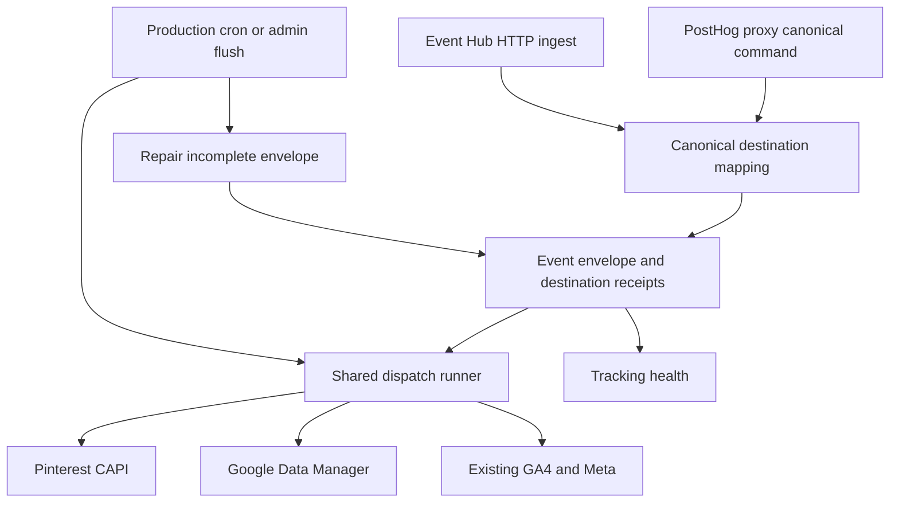
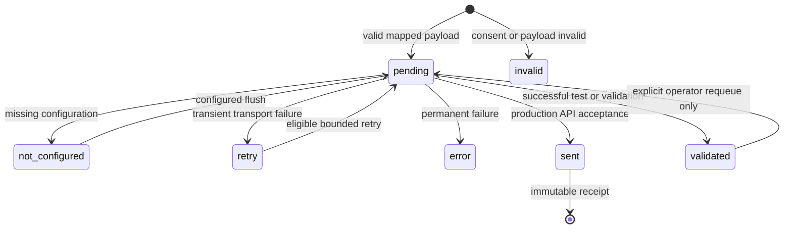

# Pinterest and Google Ads Delivery - Plan

## Goal Capsule

- Objective: Palas can deliver consented commerce events to Pinterest and Google Ads, recover interruptions, and distinguish validation from actual provider acceptance.
- Means: Extend the CRM-owned Event Hub and replace the Google Ads upload transport with Data Manager v1.
- Authority: Implementation is authorized in the isolated branch based on deployed `3c5322e`; preserve unrelated changes and existing GA4, Meta, PostHog and abandoned-cart behavior.
- Completion boundary: Verified implementation and operational instructions. Real credentials, provider-account configuration and production activation remain operator work unless separately supplied and authorized.

---

## Product Contract

### Summary

Add Pinterest as a complete Event Hub destination and migrate the existing `google_ads` destination to Google Data Manager. Provide a private, single-account OAuth bootstrap and clear delivery diagnostics.

### Problem Frame

Pinterest has no CRM delivery pipeline. The current Google connector depends on a developer token and `uploadClickConversions`, and marks successful validation requests as sent. Operators need current provider integration without duplicate browser tags or misleading delivery counts.

### Requirements

**Delivery and privacy**

- R1. Pinterest receives supported canonical commerce events through the existing PostHog/proxy → Event Hub path, including both ingestion entry points, immediate dispatch and durable retry.
- R2. Both advertising mappers fail closed unless `ad_storage`, `ad_user_data` and `ad_personalization` are explicitly true. No raw email or phone enters advertising payloads, logs or diagnostics.
- R3. Preserve the `(event_id, destination)` receipt and provider event/transaction identifier across retry, repair and replay. Existing sent receipts must never be resent.
- R4. Invalid payloads, absent configuration, terminal failures and transient failures remain distinguishable. Successful provider test/validation calls produce a separate `validated` outcome, never `sent` or `sent_at`.

**Google compatibility and operations**

- R5. Keep destination `google_ads` and the existing OAuth client/secret/refresh token, customer and per-event action environment names while using Data Manager v1 `events:ingest`. A developer token is no longer required.
- R6. Support the existing Google canonical conversion set and preserve pending legacy envelopes safely across transport migration.
- R7. Supply an operator-run OAuth bootstrap for the single Palas account, plus the Vercel environment and activation guide. Never write secrets into tracked files or request a public SaaS authorization flow.
- R8. Pinterest appears in runtime destination contracts, repair, authenticated admin command, production cron and tracking-health diagnostics. Google diagnostics describe API acceptance rather than confirmed attribution.
- R9. Automated verification uses mocked transports and isolated data. No live advertising sends, production data mutations, or new browser advertising tags occur during verification.

### Scope Boundaries

Keep central Manta dependencies and Git-driven Vercel deployment. Do not alter abandoned-cart logic or broaden into TikTok, campaign management, public OAuth onboarding, attribution polling, or historical bulk backfills.

---

## Planning Contract

### Key Technical Decisions

- KTD1. Reuse `DestinationConnector`, `dispatch-runner` leases/backoff and compact receipts for R1/R3/R8. New provider code owns mapping and transport only; shared orchestration owns persistence and scheduling. This avoids competing queues.
- KTD2. Use Pinterest v5 CAPI with stable canonical `event_id`, original event time, `action_source: web`, hashed match data and available Pinterest click ID. Use the current Pinterest schema names: page view and item view → `page_visit`, list view → `view_category`, search → `search`, add-to-cart → `add_to_cart`, checkout initiation → `initiate_checkout`, payment information → `add_payment_info`, purchase → `checkout`. Require hashed email or the IP-and-user-agent pair; click ID or external ID alone is insufficient. Unsupported canonical names remain unsupported unless a documented mapping is deliberately added. Never mislabel checkout initiation as a completed purchase. Governs R1/R2/R3.
- KTD3. Use the official Data Manager request contract with destinations, events, first-party hashed user data encoded as HEX, click identifiers, event consent and stable transaction identity. Continue per-canonical-event action selection. Preserve `GOOGLE_ADS_LOGIN_CUSTOMER_ID` via the documented operating-account relationship where applicable, rather than a legacy upload header. OAuth requires the `datamanager` scope. Governs R5/R6; protocol authority is the linked Google REST reference.
- KTD4. Return `sent` only for a valid production acceptance response, with metadata explicitly naming acceptance and retaining the provider request identifier when supplied. Pinterest response-level success alone is insufficient if its event result failed. Treat HTTP 429, 5xx and network interruptions as retryable; deterministic payload/configuration/authentication failures are terminal or not configured with actionable safe errors. Governs R4/R8.
- KTD5. Add terminal dispatch status `validated` for Google `validateOnly` and Pinterest test mode. It has no `sent_at`, is excluded from sent metrics and automatic retry, and retains enough payload to permit explicit operator requeue after disabling test mode. A mode switch must not silently send historical test events. Audit runner counters, model enums, retention and health aggregations together. Governs R3/R4.
- KTD6. The Google leaf detects persisted legacy `conversions` envelopes and returns `google_ads_payload_remap_required` without sending. Shared orchestration performs a bounded remap from the retained canonical envelope, preserving receipt keys and provider dedup identifiers. Never alter sent receipts, revive an active claim, or fall back to the retired endpoint. Missing canonical source and invalid or consent-denied remaps remain actionable unsent outcomes. Governs R2/R3/R6.
- KTD7. Add Pinterest to new-event preparation and incomplete-envelope repair atomically with existing destinations. Do not reopen every previously prepared event solely to backfill Pinterest. No schema migration is needed for destination/status text columns; update runtime model enums. Governs R1/R3/R8.

### High-Level Technical Design

### Assumptions and Activation Prerequisites

Real Pinterest account/token and Google Data Manager-enabled project, Ads account/action access and newly consented OAuth token are not available for automated verification. Existing refresh tokens may lack the new scope. The guide must cover External audience in production for the private account workflow and the need to re-consent after a scope or OAuth publishing change. Treat provider-account eligibility and true attribution as production validation, not a local-test claim.

U1 and U2 may proceed independently after this contract. U3 owns all shared files and integrates both leaf connectors. Unit authors must not modify one another's files.

---

## Implementation Units

### U1. Pinterest mapper and transport

**Goal:** Implement the Pinterest leaf contract for R1–R4 using KTD1/KTD2/KTD4/KTD5.

**Dependencies:** Shared destination/status type additions are owned by U3.

**Files:** New `demo/commerce/src/modules/event-hub/pinterest-connector.ts`; new `demo/commerce/tests/pinterest-connector.test.ts`.

**Approach:** Follow `meta-capi-connector.ts`: export config/configured helpers, a canonical mapper with the existing supported/ok/errors/payload/metadata shape, a sender accepting an abort signal, and a `pinterestDestinationConnector`. Destination is `pinterest`. Use `PINTEREST_AD_ACCOUNT_ID`, `PINTEREST_ACCESS_TOKEN`, optional explicit test mode and the fixed official Pinterest v5 API origin. No persistence in the leaf connector.

**Test scenarios:**

1. Each mapped event produces the expected Pinterest event name, time, event ID and commerce fields; purchase requires stable order identity and valid money/currency.
2. Missing, false or malformed consent blocks mapping; valid SHA-256 identifiers pass and raw personal identifiers are omitted.
3. Click ID and available user/device match data map correctly; absent required identifiers, bad timestamp and unsupported events do not send.
4. A production processed event is sent; successful test mode is validated; HTTP 200 with failed event or malformed response is not sent.
5. Missing configuration avoids fetch, 429/5xx/network interruption retries, deterministic 4xx remains actionable, and abort signals reach transport.

**Verification:** Focused connector tests prove request/response behavior without network access.

### U2. Google Data Manager transport and private OAuth bootstrap

**Goal:** Implement R2–R7 through KTD3–KTD6 while preserving the public Google connector integration surface.

**Dependencies:** U3 owns shared `validated` status.

**Files:** `demo/commerce/src/modules/event-hub/google-ads-connector.ts`; `demo/commerce/tests/google-ads-connector.test.ts`; new `demo/commerce/scripts/google-ads-oauth.mjs`; new focused OAuth script tests if logic warrants extraction.

**Approach:** Keep the existing mapper and connector exports (including compatibility aliases where callers rely on them). Migrate endpoint/configuration readiness, token acquisition, payload mapping and response handling. Return the KTD6 remap-required result for legacy envelopes; U3 owns their canonical remap. Bootstrap uses a local loopback callback with state validation, requests offline access and the Data Manager scope, and writes credentials to an operator-selected private file with mode `0600` without printing secrets; it sends no conversion and never edits Vercel automatically.

**Test scenarios:**

1. Existing customer/action env names configure the connector without a developer token; missing action or credentials is not configured.
2. Every supported conversion maps to its action, stable transaction/time/value/currency, consent and click or hashed identifiers; unsupported or malformed input is invalid.
3. OAuth refresh followed by ingest uses the Data Manager URL and authorization, with no developer-token header or uploadClickConversions call.
4. Production acceptance retains request ID/acceptance metadata; validation-only is validated with no real-sent claim.
5. A persisted legacy payload returns `google_ads_payload_remap_required` and performs no fetch; malformed or consent-denied input is never sent.
6. OAuth invalid grant/permission errors, provider validation errors, 429/5xx, response corruption and aborts have deterministic classifications without credential leakage.
7. Bootstrap rejects mismatched state and unexpected callback paths, requests the intended scope, and never sends conversions. Saved credentials have mode `0600` and terminal output contains no token or client secret.

**Verification:** Focused Google and bootstrap tests pass using stubbed OAuth/API fetches; U3 proves durable integration.

### U3. Shared integration, diagnostics and activation guide

**Goal:** Integrate U1/U2 across every Event Hub entry point and operational surface for R1–R9.

**Dependencies:** U1 and U2 leaf exports; shared type changes can land first in the working tree.

**Files:** `demo/commerce/src/modules/event-hub/destination-connector.ts`; `canonical-contract.ts`; `canonical-posthog.ts` if Pinterest identifiers need propagation; `dispatch-runner.ts`; `dispatch-repair.ts`; `entities/dispatch-log/model.ts`; `api/ingest/route.ts`; `demo/commerce/src/commands/admin/record-canonical-event-log.ts`; new admin/job `flush-pinterest-dispatches.ts` following existing flush files; `demo/commerce/vercel.json`; tracking-health query, validity and SPA files; `demo/commerce/vercel-fast-functions/admin-tracking-health.mjs` if it contains independent destination/status aggregation; retention job where status handling requires adjustment; `demo/commerce/tests/canonical-contract.test.ts`, `canonical-delivery.test.ts`, `event-hub-ingest-consent.test.ts`, `dispatch-runner.test.ts`, `dispatch-postgres.test.ts`, `tracking-health-validity.test.ts`, `tracking-retention.integration.test.ts`; new `demo/commerce/docs/ad-connectors-runbook.md`.

**Approach:** Register `pinterest` consistently and extend the status contract with `validated`. Wire both canonical command and HTTP ingest to the same provider semantics, preserve corrected-invalid replay, atomic repair and sent receipt fencing. Implement the bounded canonical Google remap from KTD6 in shared orchestration, selecting only eligible unsent legacy rows and preserving active-claim fencing. Implement authenticated production flush with existing bounded batches. Expose configuration, validation, API acceptance and errors without claiming attribution. Document new env variables, OAuth bootstrap, Vercel production-only secret setup, explicit validation-row requeue, cron diagnostics and rollback through Git.

**Test scenarios:**

1. Canonical command and HTTP ingest both create exactly one Pinterest receipt per event and enforce the same consent gate.
2. Duplicate/replayed events, concurrent flushers and lease takeover cannot resend a sent Pinterest or Google receipt; retries preserve provider identity.
3. Interrupted preparation repairs all applicable destinations atomically; existing prepared events are not implicitly backfilled.
4. A validated row has no sent timestamp, is absent from sent totals, is not reclaimed automatically, survives until explicit requeue and can later become sent exactly once.
5. Missing Pinterest configuration leaves actionable recoverable status; enabling configuration drains eligible rows through the shared runner.
6. Health payload and browser destination filters show Pinterest and validation outcomes, with no internal CRM-only events listed as sendable.
7. Cron authentication rejects unauthorized calls; scheduled jobs skip nonproduction; no abandoned-cart schedule or behavior changes.
8. A bounded legacy Google remap retains receipt and provider identifiers, revalidates canonical consent, skips sent or actively claimed rows, and exposes absent canonical source without sending. A competing flush cannot publish a stale payload after remap.
9. Existing GA4/Meta delivery, consent, replay and cart-ordering suites remain unchanged in behavior.

**Verification:** Isolated PostgreSQL tests exercise persistence, lease and retention guarantees. Browser verification follows the real tracking-health page/filter flow with outbound advertising calls disabled.

---

## Verification Contract

Use the repository's typecheck, lint and test gates in proportion to the change, then the relevant browser verification workflow for tracking-health. The existing missing Biome plugin and environment-dependent Vercel build limitations in `docs/solutions/2026-09-22-event-pipeline-rollout.md` must be reported accurately if still present. Do not describe a fallback check or blocked build as a full pass.

The release evidence must distinguish mocked provider-contract tests, isolated real-database delivery tests, local browser verification and unperformed live-account checks. Production and preview may share a database: use an isolated local database and keep advertising transports blocked in browser/runtime verification.

---

## Definition of Done

All three units meet their named scenarios, review finds no unresolved correctness blocker, and affected browser flow is verified or a precise environmental blocker is recorded. The resulting guide identifies credentials/account configuration still required and supplies the production activation and rollback steps. No live advertising acceptance or attribution is claimed without separate observed provider evidence.

---

## Sources

- `AGENTS.md` — PostHog-first architecture, central framework and Git-driven deployment constraints.
- `docs/solutions/2026-09-22-event-pipeline-rollout.md` — receipt retention, atomic repair, isolated verification and shared preview/production database risk.
- Existing `destination-connector.ts`, `meta-capi-connector.ts`, `google-ads-connector.ts`, `dispatch-repair.ts` and `record-canonical-event-log.ts` under the paths named above — implementation patterns.
- [Pinterest CAPI tracking guide](https://dev.pinterest.com/docs/track-conversions/track-conversions-in-the-api/) — request endpoint, per-event response interpretation, test mode and stable event deduplication.
- [Google Data Manager events.ingest REST reference](https://developers.google.com/data-manager/api/reference/rest/v1/events/ingest) — v1 ingest contract, OAuth scope, encoding and validation semantics.
